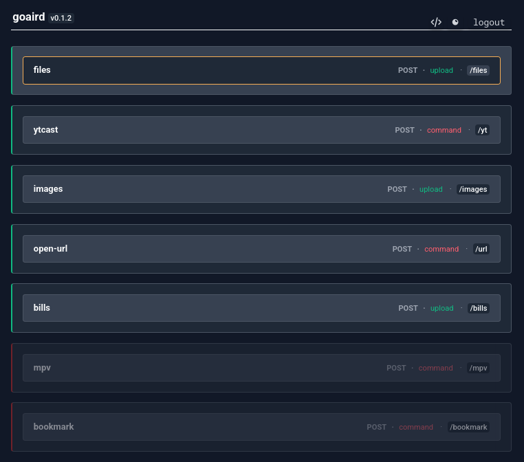

<div align="center">
    <h1><b><span style="font-size: 0.8em">✈️</span> goairdrop</b></h1>
    <span>HTTP endpoints to trigger local actions<b><span style="font-size: 0.8em"> <br>(🚧 WIP)</span></b></span>
<br>
<br>


</div>

> [!WARNING]
> This repo is a work in progress!
> Needing both cleaning up and documenting.

## Purpose

A small Go daemon that exposes HTTP endpoints to trigger local actions.

It allows sending files, URLs, or commands from external clients to your machine over HTTP.

I'm using [HTTP shortcuts](https://github.com/Waboodoo/HTTP-Shortcuts) on Android

## Idea

Define hooks → send HTTP requests → execute actions locally.

## Security

> [!WARNING]
> This daemon can execute local commands and write files.

- Add a new token to the configuration file `$XDG_CONFIG_HOME/goaird/config.json`
- Do not expose it to the public internet

## Configuration File Example (WIP)

The daemon is configured via a JSON file that defines the server settings and a list of hooks. Each hook maps an HTTP endpoint to a specific action (e.g., file upload or command execution).

<details>

```json
{
  "server": {
    "address": ":8080",
    "token": "change-default-token-1234"
  },
  "hooks": [
    {
      "name": "upload-files",
      "type": "upload",
      "endpoint": "/files",
      "method": "POST",
      "destination": "~/dls/goairdrop/upload",
      "filename_strategy": "original",
      "notify": true
    },

    {
      "name": "ytcast",
      "type": "command",
      "endpoint": "/yt",
      "method": "POST",
      "command_template": {
        "command": "ytcast",
        "args": ["-d", "shield", "{{payload.url}}"],
        "timeout_seconds": 10
      },
      "allowed_actions": ["open"],
      "notify": true
    },

    {
      "name": "upload-images",
      "type": "upload",
      "endpoint": "/images",
      "method": "POST",
      "destination": "~/dls/goairdrop/images",
      "filename_strategy": "original",
      "notify": true
    },

    {
      "name": "open-url",
      "type": "command",
      "endpoint": "/url",
      "method": "POST",
      "command_template": {
        "command": "xdg-open",
        "args": ["{{payload.url}}"],
        "timeout_seconds": 10
      },

      "allowed_actions": ["open"],
      "notify": true
    },

    {
      "name": "bills",
      "type": "upload",
      "endpoint": "/bills",
      "method": "POST",
      "destination": "~/app/service/paperless-ngx/consume",
      "allowed_mime_types": [
        "image/png",
        "image/jpeg",
        "image/webp",
        "application/pdf"
      ],
      "filename_strategy": "original",
      "notify": true
    }
  ]
}
```

</details>

## Hook Types

### `upload`

Accepts `multipart/form-data` requests and stores files on disk.

**Fields:**

- `destination`: Target directory
- `filename_strategy` (wip): How filenames are preserved or generated
- `allowed_mime_types` (optional): Restrict accepted file types
- `max_size_mb` (optional): Limit upload size

### `command`

Executes a local command using a templated payload.

**Fields:**

- `command_template.command`: Binary to execute
- `command_template.args`: Arguments (supports templating, e.g. `{{payload.url}}`)
- `timeout_seconds`: Execution timeout
- `allowed_actions`: Whitelist of accepted actions from the request

### Usage

```sh
# Send a URL to open with `xdg-open`
curl -X POST http://localhost:8080/url \
  -H "Content-Type: application/json" \
  -d '{"url":"https://kernel.org","action":"open"}'

# Send youtube video to Chromecast device using ytcast
curl -X POST http://localhost:8080/yt \
  -H "Content-Type: application/json" \
  -d '{"url":"https://www.youtube.com/watch?v=dQw4w9WgXcQ","action":"open"}'

# Send file to the bills endpoint
curl -X POST http://localhost:8080/bills \
  -H "Content-Type: multipart/form-data" \
  -F "file=@./invoice.pdf"

# Upload all JPG images in the current directory
curl -X POST http://localhost:8080/images \
  -H "Content-Type: multipart/form-data" \
  -F "files=@./*.jpg"
```

## Roadmap

- [ ] Authentication (token-based)
- [ ] Web UI improvements
- [ ] Hook validation and schema

## TO-DO:

- [x] Hooks (type: command, upload)
  - [ ] Simple WebUI for hook's edition (access: `http://localhost:8080/config`)
  <details>
      <p align="center">
          
      </p>
  </details>
- [x] Send `text/files`
  - [ ] Filename strategy (UUID, timestamp, hash, original)
- [x] Add logger
- [x] Execute command with `payload`
- [ ] Add Auth/Security
  - [ ] Link with QR-Code?
- [x] Linux notification
  - [ ] Add action to notification?
